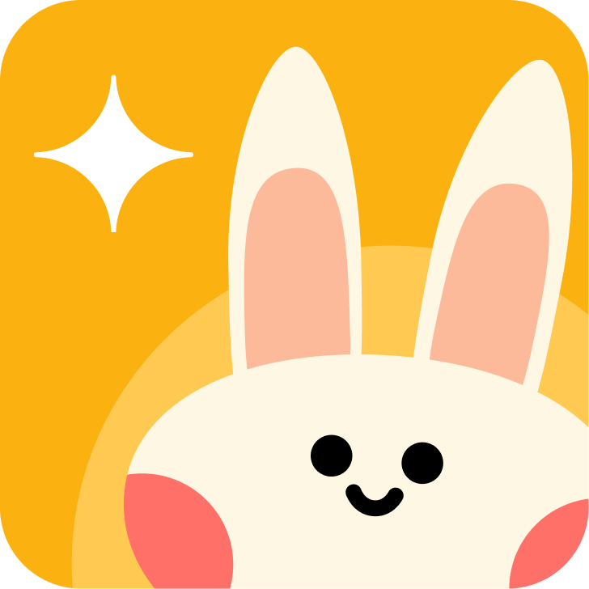

# Bisimo

 > **Mendengar yang Tak Terucap. Memahami yang Tak Terdengar.** > Aplikasi Bahasa Isyarat & Deteksi Emosional Berbasis AI untuk Anak Tunarungu.

---

## Tentang Bisimo

**Bisimo** adalah platform inklusif yang dirancang untuk menjadi ruang aman bagi anak-anak Tunarungu dalam mengekspresikan emosi mereka.

Banyak anak Tunarungu menghadapi tantangan emosional karena keterbatasan komunikasi dengan orang tua atau guru yang tidak memahami bahasa isyarat. Bisimo hadir dengan maskot **Cimo** yang menggunakan teknologi AI untuk:
1.  Mendeteksi ekspresi wajah secara *real-time*.
2.  Menjadi teman cerita yang validatif (menggunakan LLM).
3.  Menjembatani komunikasi emosional.

---

## Fitur Unggulan

### 1. Deteksi Emosi (Computer Vision)
Menggunakan teknologi AI canggih untuk membaca ekspresi wajah pengguna dan menerjemahkannya ke dalam 6 emosi dasar (Senang, Sedih, Marah, Takut, Jijik, Terkejut).

### 2. Ruang Cerita (LLM Integration)
Chatbot cerdas yang tidak hanya menjawab, tapi **memahami konteks**. Cimo memberikan respons yang empatik, validatif, dan menenangkan layaknya sahabat sejati.

### 3. Desain Inklusif (Neo-Brutalism)
Antarmuka yang dirancang dengan kontras tinggi, elemen besar, dan visual yang *playful* agar mudah diakses dan menyenangkan bagi anak-anak.

---

## Tech Stack

Project ini dibangun menggunakan teknologi modern untuk performa dan skalabilitas:

| Kategori | Teknologi |
| :--- | :--- |
| **Framework** | [Next.js 14](https://nextjs.org/) (App Router) |
| **Language** | [TypeScript](https://www.typescriptlang.org/) |
| **Styling** | [Tailwind CSS](https://tailwindcss.com/) + [DaisyUI](https://daisyui.com/) |
| **Animation** | [Framer Motion](https://www.framer.com/motion/) |
| **Fonts** | Nunito (Heading), Lexend (Body), Baloo 2 (Title) |
| **Icons** | SVG Custom Assets |

---